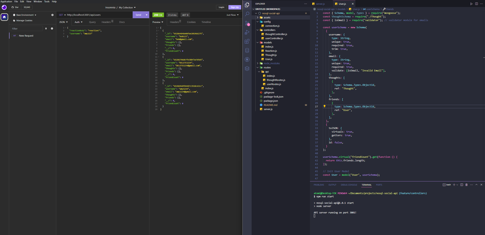

# NoSQL: Social Network API

## Description

[Video Walkthrough](https://drive.google.com/file/d/1RzCMZTrCLFwxGgorC7VF9Ev6qwTiPIKT/view)

This is a backend API to demonstrate the use of NoSQL and Mongoose. This was created using concepts learned from NW Coding Bootcamp. The repo consists of basic models for users, thoughts, and a separate schema reactions.

When running the server, you may use a service like Postman or Insomnia perform CRUD operations on both users and thoughts.

## Table of Contents

- [Installation](#installation)
- [Usage](#usage)
- [Credits](#credits)
- [License](#license)
- [How to Contribute](#how-to-contribute)

## Installation

You can demo this project by cloning the repo onto your local computer. You must install Node.js, Express.js, Mongoose, NoSQL, and the associated modules in the package.json file.

## Usage

This project can be used by anyone looking to test basic functionality when it comes to constructing a backend for Mongoose and NoSQL.

## Credits

### Github

[Yoonbacca](https://github.com/Yoonbacca)

### Email

[yoonjaekim3@gmail.com](yoonjaekim3@gmail.com)

## License

None

## How to Contribute

This is a solo project and does not require contributions at this time.
